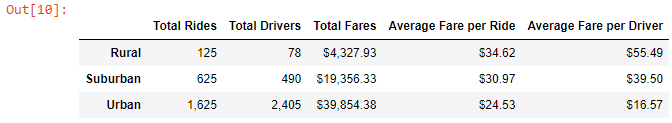
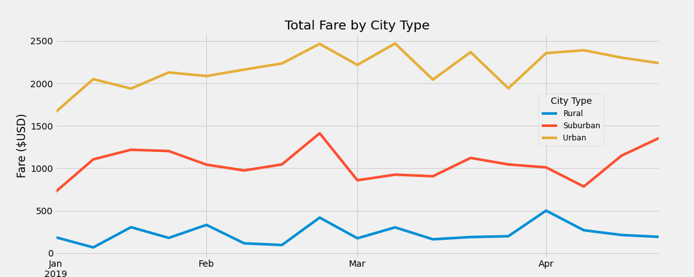

# PyBer_Analysis

## Overview of the analysis
As a Data Analyst at PyBer, you've been assigned to a new project to analyse all the ridershare data from January to early May of 2019 ([city_data.csv](Resources/city_data.csv) and [ride_data.csv](Resources/ride_data.csv)), and create a compelling visualization for the CEO, V. Isualize.

Using your Python skills and knowledge of Pandas, you’ll create a summary DataFrame of the ride-sharing data by city type. Then, using Pandas and Matplotlib, you’ll create a multiple-line graph that shows the total weekly fares for each city type. Finally, you’ll submit a written report that summarizes how the data differs by city type and how those differences can be used by decision-makers at PyBer.

## Results

- Based on the ride-sharing summary DataFrame by city type:

1. **Urban** has the highest values in **Total Rides**, **Total Drivers**, and **Total Fares**.
2. **Rural** has the least values in terms of the **Total Rides**, **Total Drivers**, and **Total Fares**.
3. When comparing with **Suburban** and **Rural**, **Urban** has 2.6 and 13 times more riders in **Total Rides**, and has about 4.9 and 30.8 times more drivers in **Total Drivers**.
4. However, **Rural** has the highest values in **Average Fare per Ride** and **Average Fare per Driver**.
5. **Urban** has the least values in **Average Fare per Ride** and **Average Fare per Driver**.
6. When comparing the **Average Fare per Ride** among the city type, **Rural** has 1.1 and 1.4 times more than **Suburban** and **Urban**.
7. When comparing the **Average Fare per Driver**, **Rural** has 1.4 and 3.3 times more than **Suburban** and **Urban**.

- Based on the multi-line chart of total fares for each city type:

1. During the time interval of Jan 2019 to Apr 2019, **Urban** has the highest **Total Fare**, **Suburban** comes to second, and **Rural** has the lowest.
2. The highest **Total Fare** for **Urban** was $2470.93 in the week of 2019-03-10.
3. The lowest **Total Fare** for **Suburban** was $67.65 in the week of 2019-01-13.

## Summary
 Based on the above results, there are some business recommendations for addressing the disparities among the city types:
 1. As the **Total Rides** in the **Urban** is the highest, this shows there are great demand on the ride-sharing in **Urban**. However, the **Average Fare per Ride** and **Average Fare per Driver** in the **Urban** area sre the lowest, increasing the fare in **Urban** area may improve the drivers' income in **Urban** area.
 2. The **Total Rides** in the **Rural** is the lowest, it indicates that the demand on the ride-sharing in **Rural** is not as high as **Suburban** and **Urban**. We may consider to launch some promotion campaigns and providing discounts in the **Rural** area to promote the business.
 3. The **Urban** has 2405 drivers (which is 4.9 and 30.8 times more drivers than **Suburban** and **Rural**), but can only contribute 2.6 and 13 times more **Total Rides**. This shows that there may be too many drivers working in the **Urban**. We may consider to reduce the numbers of drivers in **Urban** and encourage them to work in **Suburban** or **Rural**.
 
